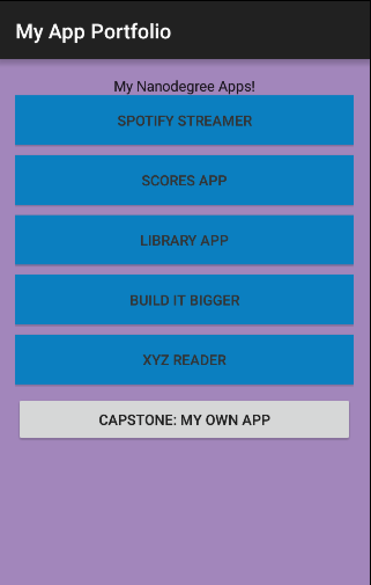

# UdacityPortfolio
This project is part of Udacity Nanodegree. This is a simple application with a list of buttons that shows a Toast to display button selected when clicking on them.

# Screenshots

## License
The content of this repository is licensed under a [Apache License, Version 2.0](http://www.apache.org/licenses/LICENSE-2.0)
